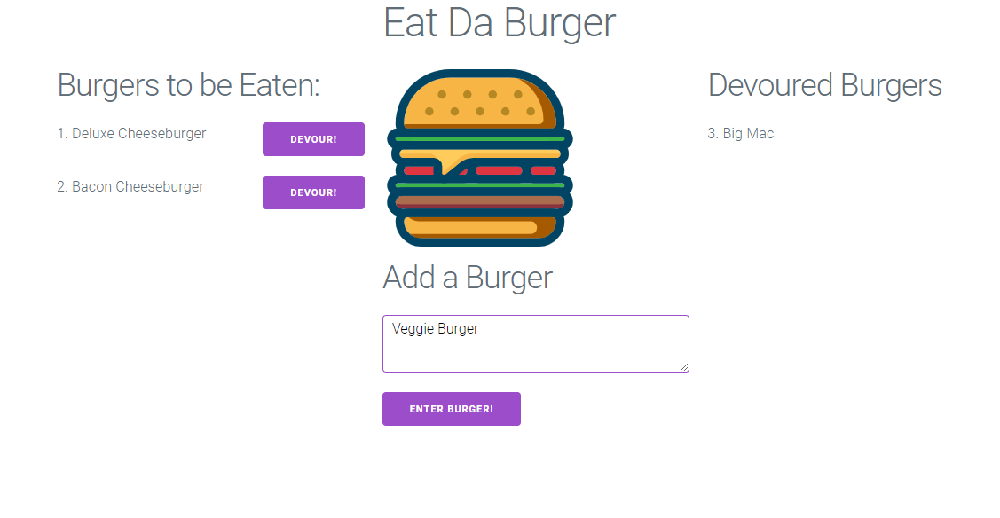

# eat-da-burger-11

  

  ## Description:

  App for inputting and devouring burgers. Demonstrates understanding and application of MVC principles and uses MySQL, Node, Express and Handlebars.

  [Link to GitHub Repo](https://github.com/GAFelton/eat-da-burger-11)
  
  [Link to Deployed Project](http://gentle-chamber-60009.herokuapp.com/)

  ## Table of Contents

 * [Installation](#Installation)
 * [Usage](#Usage)
 * [License](#License)
 * [Contributing](#Contributing)
 * [Questions](#Questions)

  

  ## Installation

    1. Fork and Clone the repo.
    2. Create the required MySQL database "burgers_db".
    3. Make sure you input your mysql password and username correctly.
    4. Run server.js and use via your browser.

  

  ## Usage

  On the deployed site, add burgers via the add burger form or devour them to move them from one column to the other.

  ## License

  MIT

  

  ## Contribution Guidelines

  Pull requests and issues are welcome.

 

  ## Questions

  Please address questions to GAFelton.

  [Link to Profile](https://github.com/GAFelton)

  [E-mail](64555318+GAFelton@users.noreply.github.com)
